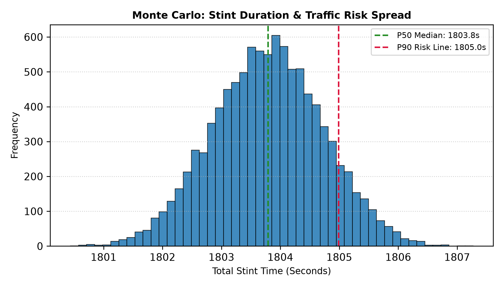

# f1 race strategy & tire degradation models

python toolkit for simulating f1 race strategy, compound degradation crossovers, and monte carlo traffic/wear risk spreads. designed to evaluate pit windows and stint performance profiles.

## visual outputs

### compound degradation & pit strategy crossover


### monte carlo stint risk spread


## what's in here
- `tire_strategy.py`: models linear wear and exponential thermal degradation for hard vs. soft compounds, automatically calculating the exact pit window crossover lap and generating a comparison plot.
- `monte_carlo_stint.py`: runs 10,000-iteration probabilistic simulations over a stint to map p50 median expectations against p90 worst-case traffic/wear risk lines.

## governing equations

### 1. tire degradation & crossover model
lap times incorporate base pace, linear mechanical wear, and non-linear thermal degradation:
- `LapTime = base_time + (wear_rate * lap) + (thermal_factor * (lap^1.5) * 0.04)`

### 2. monte carlo stint risk spread
stint variations are sampled from a normal distribution and scaled non-linearly over distance:
- `StintTime = (base_lap * laps) + (deg_samples * (laps^1.1))`

## quick setup
1. make sure you have dependencies installed:
   ```bash
   pip install numpy pandas matplotlib
