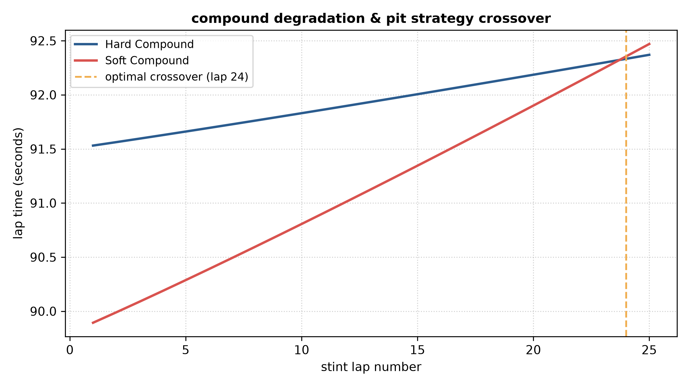

# 🏎️ Motorsport Analytics & Race Strategy Dashboards

An advanced race strategy analytics toolkit featuring a **Compound Degradation & Pit Strategy Crossover Engine** for optimal pit stop timing and a **Monte Carlo Stint Risk Simulator** for probabilistic traffic and wear risk assessment.

---

## 🚀 Visual Outputs & System Dashboards

### 1. Compound Degradation & Pit Strategy Crossover (`tire_strategy.py`)
Models linear wear and exponential thermal degradation for hard vs. soft compounds, automatically identifying the crossover lap.


### 2. Monte Carlo Stint Risk Spread (`monte_carlo_stint.py`)
Runs 10,000-iteration probabilistic simulations over a stint to map p50 median expectations against p90 worst-case traffic and wear risk boundaries.


---

## 📂 Repository Layout & Core Modules

* tire_strategy.py: Models linear wear and exponential thermal degradation for hard vs. soft compounds, automatically calculating the exact pit window crossover lap.
* monte_carlo_stint.py: Executes 10,000-iteration stochastic simulations over a race stint to map median versus p90 worst-case risk distributions.

---

## 📐 Mathematical Foundations & Governing Equations

### 1. Tire Degradation & Crossover Model
Lap times incorporate base pace, linear mechanical wear, and non-linear thermal degradation:

$$\text{LapTime} = \text{base\_time} + (\text{wear\_rate} \cdot \text{lap}) + \left(\text{thermal\_factor} \cdot \text{lap}^{1.5} \cdot 0.04\right)$$

### 2. Monte Carlo Stint Risk Spread
Stint variations are sampled from a normal distribution and scaled non-linearly over cumulative race distance:

$$\text{StintTime} = (\text{base\_lap} \cdot \text{laps}) + \left(\text{deg\_samples} \cdot \text{laps}^{1.1}\right)$$

---

## 🛠️ Installation & Usage

1. **Clone the repository:**
   ```bash
   git clone [https://github.com/SmyanAggarwal/motorsport-strategy-dashboards.git](https://github.com/SmyanAggarwal/motorsport-strategy-dashboards.git)
   cd motorsport-strategy-dashboards
